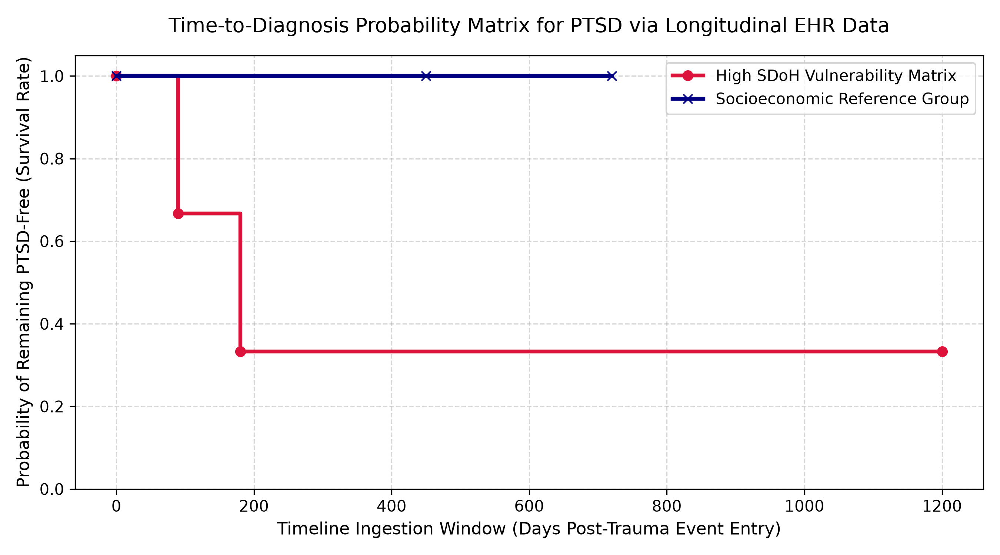

# Longitudinal EHR Survival Analysis for Time-to-Diagnosis of PTSD

A statistical framework built in Python utilizing `lifelines` to model the clinical timeline to an official PTSD diagnosis from longitudinal Electronic Health Records (EHR) while accounting for right-censoring.

## 📈 The Statistical Challenge: Right-Censoring
In longitudinal health research using EHR databases, tracking the exact time from a trauma event to an official PTSD diagnosis introduces **right-censoring**. This occurs when a patient's final clinical state is unknown because they:
1. **Drop out of follow-up** (e.g., they move away or switch insurance providers mid-study).
2. **Reach the end of the study** without ever developing symptoms or receiving a formal diagnosis code.

Standard regression techniques (like linear or logistic models) fail because they drop these incomplete observations entirely or misclassify them as "healthy," severely biasing clinical outcomes. **Survival Analysis** solves this by factoring in the exact number of days a patient contributed data before drop-out, preserving statistical power.

## 🚀 The Methodology
This pipeline processes an EHR longitudinal patient data matrix to calculate time-to-event outcomes:
* **Time Scale (\(T\)):** Total continuous observation days (`observation_days`) recorded post-trauma incident.
* **Event Indicator (\(\delta\)):** Binary variable (`ptsd_diagnosed`) where `1` indicates an official clinical PTSD diagnosis code, and `0` indicates a right-censored event.
* **Stratified Estimation:** Utilizes the non-parametric **Kaplan-Meier Estimator** to chart survival curves comparing patients exposed to negative Social Determinants of Health (SDoH) risk matrices against a standard reference group.

## 📁 Repository Map
```text
├── ehr_patient_cohort.json    # Longitudinal patient observation timelines
├── survival_pipeline.py       # Kaplan-Meier estimator and plotting logic
├── requirements.txt           # Project library dependencies
└── README.md                  # Project portfolio documentation
```

## 🛠️ Execution & Setup

### 1. Install Libraries
```bash
pip install lifelines pandas matplotlib
```

### 2. Run the Pipeline
Execute the analytical script to process the longitudinal matrices and output the curves:
```bash
python survival_pipeline.py
```

## 📊 Analytical Findings & Visualization
The pipeline transforms raw longitudinal timestamps into a clinical survival probability function, automatically adjusting for patient loss to follow-up over a 3-year window.

### 📉 Kaplan-Meier Probability Chart:


*The plot clearly displays a steeper drop in the probability of remaining PTSD-free over time for patients under high SDoH vulnerability matrices compared to the socioeconomically stable reference cohort.*
